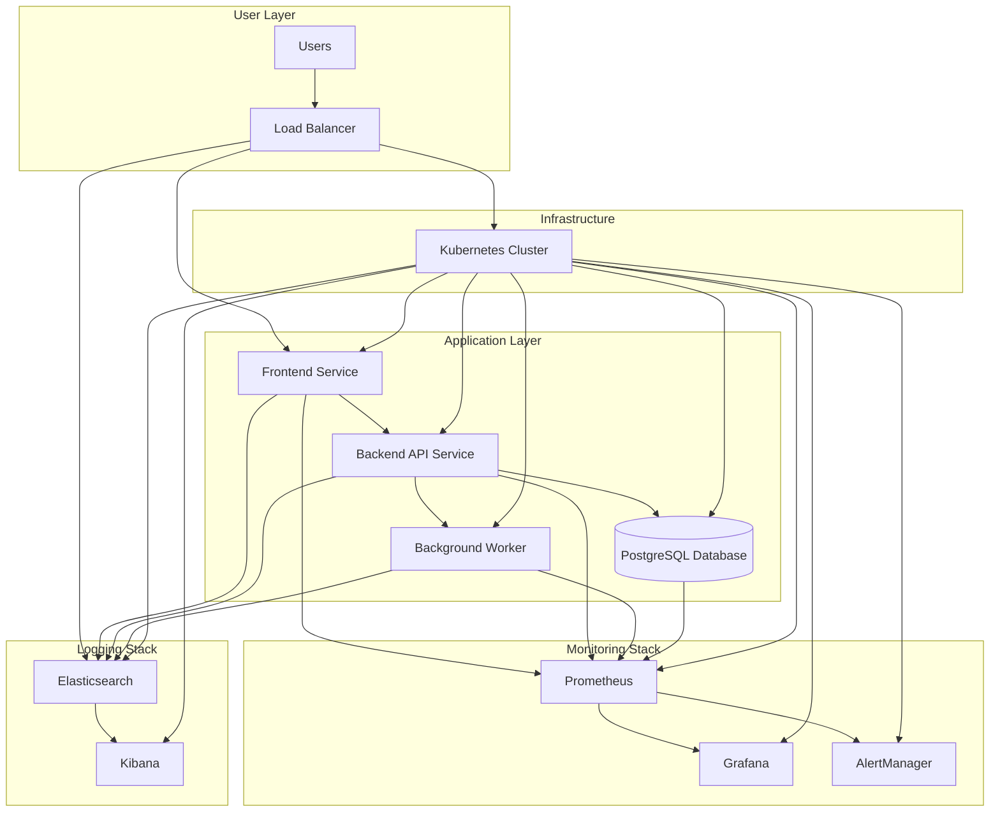

# SRE E-Commerce Platform - Complete Site Reliability Engineering Reference Project

## 🎯 Project Overview

This project demonstrates a complete, production-inspired e-commerce platform built with modern microservices architecture, showcasing real-world Site Reliability Engineering (SRE) practices. It's designed as an interview-ready reference project that demonstrates how SREs work in a DevOps model.

## 🏗️ Architecture



## 📁 Project Structure

```
sre-ecommerce-platform/
├── services/                    # Microservices applications
│   ├── frontend/               # React frontend service
│   ├── backend/                # Node.js/Express API service
│   ├── worker/                 # Background job processor
│   └── database/               # PostgreSQL database schemas
├── kubernetes/                 # Kubernetes manifests and configs
│   ├── manifests/             # Deployment, Service, ConfigMap manifests
│   └── configs/               # Configuration files
├── monitoring/                 # Monitoring stack configurations
│   ├── prometheus/            # Prometheus rules and configs
│   ├── grafana/               # Grafana dashboards
│   └── alertmanager/          # AlertManager routing rules
├── logging/                    # ELK stack configurations
├── scripts/                    # Setup, teardown, and utility scripts
├── docs/                      # Detailed documentation
├── tests/                     # Integration and load tests
└── .github/workflows/         # CI/CD pipelines
```

## 🚀 Quick Start

### Prerequisites
- Docker Desktop
- kubectl
- Helm
- Node.js 18+
- Make (optional)

### Local Development Setup
```bash
# Clone and setup
git clone <repository>
cd sre-ecommerce-platform

# Start all services locally
./scripts/setup.sh

# Deploy to Kubernetes (Kind/Minikube)
./scripts/deploy-k8s.sh

# Access services
kubectl port-forward svc/frontend 3000:3000
kubectl port-forward svc/backend 8080:8080
```

### Services Access Points
- **Frontend**: http://localhost:3000
- **Backend API**: http://localhost:8080
- **Grafana**: http://localhost:3001 (admin/admin)
- **Prometheus**: http://localhost:9090
- **Kibana**: http://localhost:5601

## 🎯 What an SRE Does in This Project

### 1. System Reliability Management
- **SLI/SLO Implementation**: Monitor response times, error rates, and availability
- **Error Budget Management**: Track and report on service reliability targets
- **Capacity Planning**: Ensure services can handle expected load

### 2. Incident Management
- **Monitoring & Alerting**: Set up comprehensive monitoring and alerting rules
- **Incident Response**: Follow documented procedures for different failure scenarios
- **Post-mortem Analysis**: Document and learn from incidents

### 3. Automation & CI/CD
- **Deployment Automation**: Automated building, testing, and deployment pipelines
- **Infrastructure as Code**: Kubernetes manifests and configuration management
- **Self-healing Systems**: Automatic restarts, scaling, and recovery mechanisms

### 4. Performance & Scalability
- **Load Testing**: Regular performance testing and optimization
- **Horizontal Scaling**: Auto-scaling based on metrics
- **Resource Optimization**: Monitor and optimize resource usage

## 🔧 Kubernetes Deep Dive

### Core Components Demonstrated
- **Pods**: Basic deployment units for containers
- **Deployments**: Rolling updates and rollback capabilities
- **ReplicaSets**: Maintaining desired pod count
- **DaemonSets**: Monitoring and logging agents on all nodes
- **CronJobs**: Scheduled background tasks
- **Services**: Service discovery and load balancing
- **ConfigMaps & Secrets**: Configuration and credential management
- **Volumes**: Persistent data storage

### Common kubectl Commands
```bash
# Cluster management
kubectl cluster-info
kubectl get nodes
kubectl describe node <node-name>

# Application management
kubectl get pods --all-namespaces
kubectl get deployments
kubectl get services
kubectl describe deployment <deployment-name>
kubectl logs <pod-name>

# Scaling and updates
kubectl scale deployment <name> --replicas=3
kubectl set image deployment/<name> <container>=<new-image>
kubectl rollout status deployment/<name>
kubectl rollout undo deployment/<name>
```

## 📊 Monitoring & Observability

### Monitoring Verticals
1. **Application Health**
   - Response times and error rates
   - Business metrics (orders, user registrations)
   - Custom application metrics

2. **System Health**
   - CPU, memory, disk usage
   - Network latency and throughput
   - Container resource limits

3. **Database Monitoring**
   - Connection pool status
   - Query performance
   - Replication lag

4. **Log Monitoring**
   - Application logs
   - System logs
   - Security events

5. **Security Monitoring**
   - Authentication failures
   - Suspicious activity patterns
   - Vulnerability scanning

### Key Metrics & Alerts
- **High Error Rate**: >5% error rate for 5+ minutes
- **High Latency**: P95 latency >2 seconds for 3+ minutes
- **Service Unavailability**: Service down for >1 minute
- **Resource Exhaustion**: CPU >90% for 10+ minutes, Memory >85%
- **Database Issues**: Connection failures, slow queries

## 🚨 Incident Management Workflow

### Incident Levels
- **L1**: Basic troubleshooting (restart services, check logs)
- **L2**: Advanced debugging (performance issues, configuration)
- **L3**: Critical issues (infrastructure, security)

### On-Call Readiness
- **Escalation Policies**: Automatic escalation if no response
- **Runbooks**: Step-by-step procedures for common issues
- **Communication Channels**: Slack, PagerDuty, email alerts

### Sample Incident Scenarios
1. **Pod Crash Loop**: Container repeatedly failing to start
2. **High Latency**: API response times exceeding SLOs
3. **Database Connection Failure**: Service can't connect to database
4. **Disk Full**: Log or data volumes filling up
5. **Configuration Error**: Misconfigured secrets or configmaps

## 🔄 CI/CD Pipeline

### GitHub Actions Workflow
1. **Code Quality**: Linting and formatting checks
2. **Unit Tests**: Automated testing of individual services
3. **Build**: Docker image creation and tagging
4. **Security Scan**: Vulnerability scanning of images
5. **Integration Tests**: End-to-end testing
6. **Deployment**: Progressive deployment to Kubernetes

### Deployment Strategies
- **Blue-Green**: Zero-downtime deployments
- **Canary**: Gradual traffic shifting
- **Rolling**: Controlled rolling updates

## 🧪 Failure Scenarios & Debugging

### Scenario 1: Pod Crash Loop
**Symptoms**: Pod status shows `CrashLoopBackOff`
**Metrics**: High restart count, container exit codes
**Logs**: Application error messages, OOM killer events
**Root Cause**: Application configuration error or resource limits
**Fix**: Check pod logs, verify configuration, adjust resource requests

### Scenario 2: High Latency
**Symptoms**: Slow API responses, user complaints
**Metrics**: Increased P95/P99 latency, high CPU usage
**Logs**: Slow query logs, timeout errors
**Root Cause**: Database performance issues or resource constraints
**Fix**: Scale horizontally, optimize queries, add caching

### Scenario 3: Database Connection Failure
**Symptoms**: 500 errors, connection timeouts
**Metrics**: Database connection errors, high connection pool usage
**Logs**: Connection refused, authentication failed
**Root Cause**: Database down, network issues, credential rotation
**Fix**: Restart database, check connectivity, update credentials

## 📚 Learning Summary

### Key SRE Concepts Demonstrated
1. **Reliability Engineering**: SLI/SLO implementation and error budget management
2. **Incident Management**: Structured response to system failures
3. **Automation**: CI/CD pipelines and self-healing systems
4. **Monitoring**: Comprehensive observability stack
5. **Capacity Planning**: Resource scaling and performance optimization

### Real-World SRE Job Mapping
- **System Design**: Architecture decisions and trade-offs
- **Problem Solving**: Debugging complex distributed systems
- **Communication**: Incident documentation and stakeholder updates
- **Process Improvement**: Post-mortems and reliability enhancements
- **Tool Mastery**: Kubernetes, Prometheus, Grafana, ELK stack

### Interview Talking Points
1. **Architecture Decisions**: Why microservices, why Kubernetes
2. **Monitoring Strategy**: What to monitor and why
3. **Incident Response**: How to handle failures gracefully
4. **Automation**: How to reduce manual intervention
5. **Continuous Improvement**: How to evolve the system

### Next Steps to Explore
- **Service Mesh**: Istio or Linkerd implementation
- **Chaos Engineering**: Failure injection testing
- **Advanced Security**: Zero-trust networking, RBAC
- **Multi-Cluster**: Geographic distribution and disaster recovery
- **Cost Optimization**: Resource efficiency and rightsizing

## 🛠️ Setup Scripts

### Complete Setup
```bash
# Install dependencies and create cluster
./scripts/install-prereqs.sh
./scripts/create-cluster.sh

# Deploy all services
./scripts/deploy-all.sh

# Setup monitoring
./scripts/setup-monitoring.sh

# Run load test
./scripts/load-test.sh
```

### Cleanup
```bash
# Remove all deployments
./scripts/teardown.sh
```

## 📖 Additional Documentation

- [Detailed Architecture Guide](docs/architecture.md)
- [SRE Playbooks](docs/playbooks/)
- [Monitoring Setup](docs/monitoring.md)
- [Troubleshooting Guide](docs/troubleshooting.md)
- [Performance Tuning](docs/performance.md)

---

**Built for SRE interviews and learning purposes. This project demonstrates production-ready SRE practices using modern DevOps tools and methodologies.**